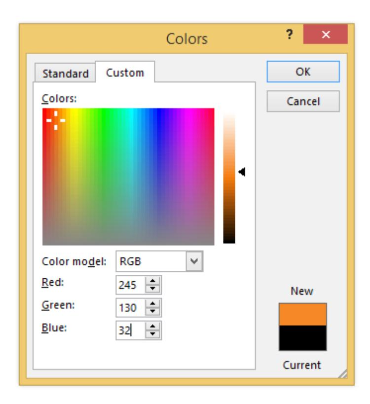

\customTitle{Document Control}

| Version | Change description | Changed by | Date |
|---|---|---|---|
| 0.1 | Initiate | MinhNT | Dec 16, 2014 |
| 0.2 | Update content... | MinhNT | Dec 20, 2014 |

: abc  

\insertTOC  

\insertListTables  

\insertListFigures

# **Introduction**

## **Purpose**

This document specifies conventions for naming and version of documents which are in scope of QMS & ISMS.

## **Scope**

This convention is applied to only the controlled documents, which are internally created by Bestarion.

Following documents are outside the scope of this convention:

- Uncontrolled documents and records
- Documents obtained from external sources (such as, government regulatory,...)
- Project documents to follow customers' conventions, regarding naming and/ or version

## **Definition And Abbreviation**

BoD: Board of Directors

QM: Quality Management

Controlled Document: A document with its versions to be controlled, in order to ensure appropriate

access to correct content. When a controlled document is to be changed, its new

version must be controlled via appropriate review and approval procedures

Document: Information and its supporting medium (text files, images, video, voice,...)

Record: Is a kind of document which is resulted from performing operations

## **References**

- [1] Document\_Responsibility\_Authority\_Standard
- [2] Control\_Of\_Documented\_Information

# **Regulation**

The objective for document owner when creating a new document is no more than 1 easily identifiable error in 5 A4 pages

# **Naming Of Controlled Non-record Documents**

When a controlled document is not a record, the file name shall follow below format:

**[Document Code]-[Document Name]-[Version Number]**

Each part is separated by a hyphen.

## **Document Code**

The document code can be used as a short name to refer to the document.

Document Code is constructed by following format:

**[Unit Code].[Document Type Code].[Ordinal Number]**

Each part is separated by a stop ('.').

- **Unit Code**: Code representing the unit
  - In case unit is a department or portfolio: refer to corporate organizational structure for the corresponding code
  - In case unit is a sub-group within a department or a portfolio: refer to the department/ portfolio charter for the corresponding code
  - In case document apply in a sub-company, unit code may be included company name
- **Document Type Code**: Refer to [\[1\]](#page-5-8) for the codes of document types
- **Ordinal Number** (3 digits): A unique number to differentiate documents in the same document type, belonging to the same unit

*Examples: HR.GUI.234, QM.POL.001*, *Bestarion.IT.POL.001*...

## **Document Name**

Document name is a unique name of document, with following convention:

- The first letter of each word shall be in capital
- Words are separated by underscore character ('\_')

*Examples: Project\_Planning, Risk\_Management.*

 Document name should not include the type of document, since the type is already known in Document Code part [\(3.1.\)](#page-5-1)

## **Version Number**

A version number is constructed of 3 numbers: "Major version number", "Minor version number" and "Draft number".

Those numbers are separated by a underscore ("\_").

**[Major Version Number]\_[Minor Version Number]\_[Draft Number]**

- **Major version number**: Started from 0. The first baseline has major version equals 1. Major version is increased when there are changes to the document content, which affect to the original meaning of the document
- **Minor version number**: Started from 0. Minor version is increased when there are only changes to enhance or correct the content, while the original meaning is intact
- **Draft number**: Started from 1. This number is increased when a draft is updated and re-submitted for review. A document may pass through several draft updates until it is baseline
- **Note:** Before the first baseline of each document, draft version number for document is constructed of 2 numbers: "Major version number" and "Draft number"
- *Examples:*
  - *QM.POL.001-Quality\_Manual-0\_1 The first draft of policy 'Quality Manual', issued by QM*
  - *QM.POL.001-Quality\_Manual-0\_2 The second draft, re-submitted for review*

|  | QM.POL.001-Quality_Manual-1_0   | The first baseline of policy 'Quality Manual', issued by QM |
|---|---------------------------------|----------------------------------------------------------------|
|  | QM.POL.001-Quality_Manual-1_0_1 | The first draft version after the first baseline               |
|  | QM.POL.001-Quality_Manual-1_1   | The minor baseline of the document, based on version 1.0    |
|  | QM.POL.001-Quality_Manual-2_0   | The major baseline of the document, based on version 1.x    |

- aouwhfuahfuawhfuawd 
- Sua lan 2

