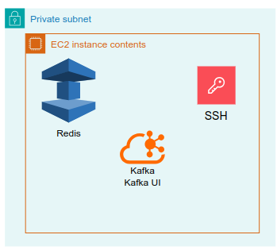
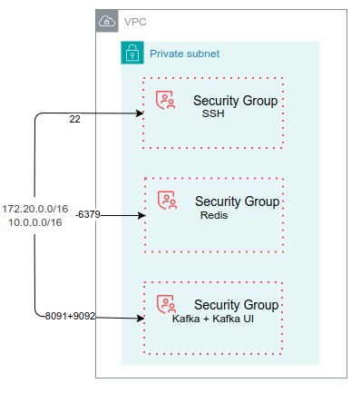

# **Overview**

## **Purpose**

This document provides comprehensive guidance for deploying an EC2 instance in the AWS nonprod testing environment using Terraform Infrastructure as Code (IaC). The instance will host Apache Kafka, Redis, and related services with proper networking, security controls, and access management. The deployment follows AWS best practices and maintains consistency with the existing MAX project infrastructure.

## **Scope**

This guide encompasses the complete deployment lifecycle for other services infrastructure using Terraform. It provides step-by-step instructions for provisioning compute resources, configuring security controls, setting up networking integration, and managing the deployment through the S3 remote state backend.

The scope does NOT include:
- VPC and networking infrastructure creation
- Load balancing or auto-scaling setup

## **Abbreviations and Definitions**

- **EC2**: Elastic Compute Cloud - AWS cloud computing service that provides virtual servers. This is where Kafka, Redis, and related services run.

- **VPC**: Virtual Private Cloud - A private virtual network in AWS that allows users to create a separate network space with complete control over IP addressing and routing.

- **AMI**: Amazon Machine Image - A pre-configured virtual machine image used to launch EC2 instances. Contains the operating system, applications, and services needed.

- **CIDR**: Classless Inter-Domain Routing - An IP routing method that allows for efficient allocation and management of IP address ranges using prefix notation.

- **IAM**: Identity and Access Management - AWS service that manages user access and permissions for AWS resources.

- **SSH**: Secure Shell - A cryptographic network protocol for secure data communication and remote command execution.

- **SSM**: Systems Manager - AWS service that provides a unified interface for managing and automating operational tasks across AWS resources.

- **EBS**: Elastic Block Store - A scalable block storage service for use with EC2 instances, providing persistent storage.


# **Architecture**
## **Diagram**
 

 

## **Directory Structure**
```
/nonprod/testing/other-services/
├── .terraform.lock.hcl
├── main.tf
├── versions.tf
└── outputs.tf
```


# **Requirements**

The Terraform configuration must meet the following requirements:

1. **Network Integration**: The EC2 instance must be placed in the same network as other services for proper communication and resource sharing. (managed in `live/nonprod/general/networking`)

2. **Operating System Image**: Use the latest Ubuntu AMI available at the time of deployment for current security patches and features. 

3. **CIDR Ranges**: Configure access from two CIDR ranges:
   - CIDR block containing current resources 
   - CIDR block of the MSS project 

4. **Resource Tagging**: Apply consistent tags to all resources for management and governance:
   - **Environment**: Deployment environment designation
   - **Project**: Project identifier
   - **Owner**: Responsible party or team
   - **Service**: Service name

5. **Security Group Configuration**: Security groups must be properly configured to restrict access to only the required ports from authorized CIDR ranges, enhancing overall security posture.

6. **Outbound Internet Access**: The EC2 instance must have outbound internet connectivity to download OS updates, security patches, and required software packages.

7. **Instance Naming Convention**: EC2 instances must follow the established naming convention for easy identification and management.

8. **Instance Type Selection**: Choose an appropriate instance type that balances resource requirements for Kafka, Redis, and related services while optimizing for cost efficiency.

9. **IAM Role Configuration**: Configure the IAM role to ensure the EC2 instance has necessary permissions to access AWS Systems Manager and other required AWS services.

10. **Private Subnet Deployment**: Deploy the EC2 instance in a private subnet to enhance security and prevent direct internet exposure.

11. **SSH Key Pair**: Reuse the existing key pair for SSH access, ensuring consistency across the nonprod environment.


# **Prerequisites**

Before running the Terraform configuration, verify the following prerequisites are met:

## **Terraform and AWS Provider Requirements**

| Name | Version |
|------|---------|
| terraform | >= 1.5.0 |
| aws | >= 5.0 |

: abc

### **Providers**

| Name | Version |
|------|---------|
| aws | 6.22.1 |
| terraform | n/a |

: bcd

## **Prerequisites**

1. **VPC and Subnets**: Verify that the VPC and required subnets exist and are properly configured.  
2. **VPC Configuration**: Confirm that VPC ID and subnet name tags match the Terraform configuration.  
3. **IAM Permissions**: Ensure your AWS credentials have all required EC2, S3, and IAM permissions for resource creation.  
4. **AMI Availability**: Verify that the specified AMI ID is valid and available in the region.  
5. **AWS Systems Manager Role**: Verify that the AmazonSSMRoleForInstancesQuickSetup IAM role exists in your AWS account.  
6. **SSH Key Pair**: Verify that the key pair exists in the region for EC2 instance access.  
7. **Terraform Module**: Verify that the EC2 module is available at the correct path.  
8. **CIDR Range Validation**: Confirm that both CIDR ranges are properly configured and accessible.  
9. **AWS CLI Connectivity**: Ensure your machine has network connectivity to AWS APIs and can authenticate with your AWS credentials.  
10. **Remote State Backend**: Verify that the S3 backend and networking state file exist for remote state management.


# **Deployment Instructions**

## **Deploy Infrastructure**

### **Step 1: Initialize Terraform Workspace**

Navigate to the Terraform directory and initialize the workspace:

```bash
cd /nonprod/testing/other-services
terraform init
```

This command downloads required providers and initializes the backend.

### **Step 2: Validate Configuration Syntax**

Verify the Terraform configuration syntax:

```bash
terraform validate
```

Expected output: `Success! The configuration is valid.`

### **Step 3: Format Code (Optional)**

Format Terraform files for consistency:

```bash
terraform fmt -recursive
```

### **Step 4: Generate Execution Plan**

Create a detailed plan of infrastructure changes:

```bash
terraform plan -out=tfplan
```

Review the plan:

```bash
terraform show tfplan
```

### **Step 5: Apply Configuration**

Deploy infrastructure according to the plan:

```bash
terraform apply tfplan
```

Expected output: `Apply complete! Resources: 9 added, 0 changed, 0 destroyed.`

### **Step 6: Retrieve Outputs**

Display infrastructure outputs:

```bash
terraform output
```

### **Step 7: Retrieve SSH Private Key**

Get the private key for SSH access:

```bash
RETRIEVE_CMD=$(terraform output -raw retrieve_private_key_command)
eval $RETRIEVE_CMD
```

### **Step 8: Connect to EC2 Instance**

Establish SSH connection to the instance:

```bash
INSTANCE_IP=$(terraform output -raw instance_private_ip)
ssh -i max.dev.key.01.pem ec2-user@$INSTANCE_IP
```

## **Redeploying After Accidental Destruction**

If the EC2 instance is accidentally terminated outside of Terraform:

```bash
# Refresh Terraform state
terraform refresh

# Check state
terraform state list

# Reapply to recreate the instance
terraform apply -auto-approve
```

## **Destroying and Recreating Infrastructure**

To completely remove and redeploy:

```bash
# Review resources to be destroyed
terraform plan -destroy -out=tfplan_destroy
terraform show tfplan_destroy

# Destroy all resources
terraform apply tfplan_destroy

# Recreate from scratch
terraform apply -auto-approve
```

**Critical Warning**: This will permanently delete all resources including the EC2 instance and security groups.

## **Applying Partial Changes (Targeted Apply)**

To apply changes to specific resources only:

```bash
# Example: Update only the security group without touching EC2
terraform apply -target=aws_security_group.other_services

# Example: Update specific security group rule
terraform apply -target='aws_security_group_rule.allow_kafka'

# Update EC2 module only
terraform apply -target='module.ec2'
```

**Note**: Use targeted applies with caution as it may cause inconsistencies.

## **Backup Current State Before Major Changes**

Before making significant changes, backup the current state:

```bash
# Backup current state locally
cp terraform.tfstate terraform.tfstate.backup.$(date +%Y%m%d_%H%M%S)

# Or view current state
terraform state show

# Verify remote state in S3
aws s3 cp s3://meperia-edi/terraform/testing/other-services/terraform.tfstate terraform.tfstate.remote
```

## **Reviewing and Approving Changes (Plan Review Process)**

For change control and approval:

```bash
# Generate detailed plan in JSON format for review
terraform plan -out=tfplan -json > tfplan.json

# Generate human-readable summary
terraform plan -out=tfplan > tfplan.txt

# Share plan files for review and approval before applying
# Once approved, proceed with apply
terraform apply tfplan
```


# **Appendix**

### **Modules**

| Name | Source | Version |
|------|--------|---------|
| ec2 | ../../../../modules/ec2 | n/a |

### **Resources**

| Name | Type |
|------|------|
| aws_security_group.other_services | resource |
| aws_security_group_rule.allow_kafka | resource |
| aws_security_group_rule.allow_kafka_ui | resource |
| aws_security_group_rule.allow_redis | resource |
| aws_security_group_rule.allow_ssh | resource |
| aws_subnet.private_app_a | data source |
| terraform_remote_state.networking | data source |

### **Inputs**

No inputs required.

### **Outputs**

| Name | Description |
|------|-------------|
| ebs_volume_id | ID of the attached EBS volume |
| effective_key_name | The key name associated with the EC2 instance |
| instance_id | ID of the created EC2 instance |
| instance_private_ip | Private IP of the EC2 instance |
| private_key_parameter_name | SSM Parameter name storing the generated private key (if generated) |
| retrieve_private_key_command | AWS CLI command to retrieve the private key from SSM Parameter Store |

## **Troubleshooting**

### **Common Issues**

- **Backend State Not Found**: Verify S3 bucket and networking state file exist
- **VPC/Subnet Not Found**: Confirm VPC ID and subnet name tags match configuration
- **IAM Permissions Denied**: Verify IAM role has required permissions
- **AMI Not Available**: Verify AMI ID is valid and available in region
- **Key Pair Not Found**: Ensure SSH key pair exists in AWS region

## **References**

For additional information, refer to:

- Terraform AWS Provider Documentation
- AWS EC2 User Guide
- AWS VPC Best Practices
- Security Group Configuration Guide

