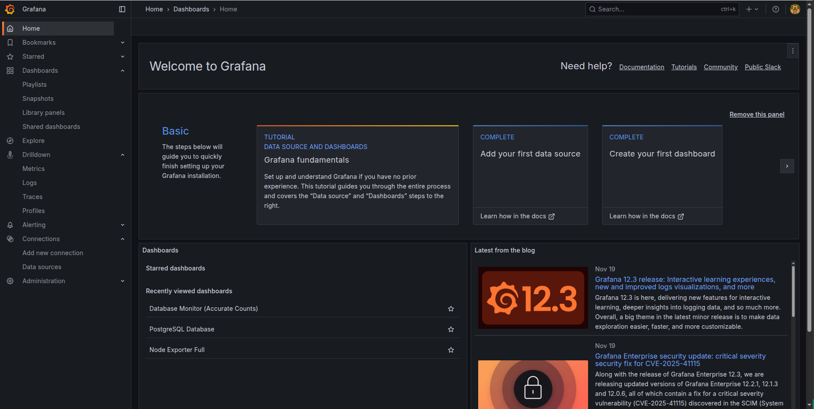
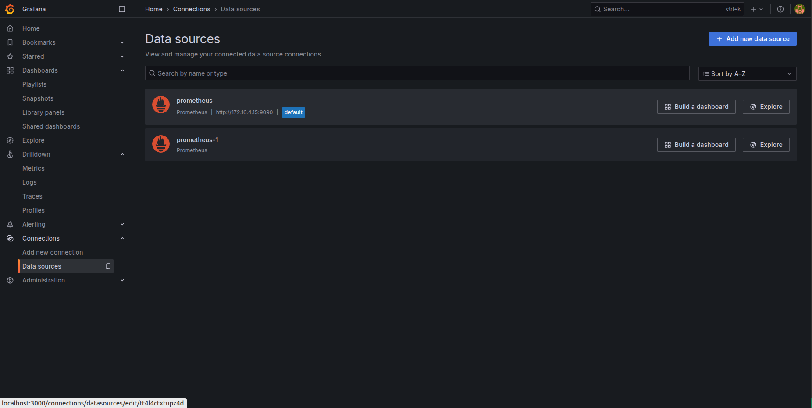
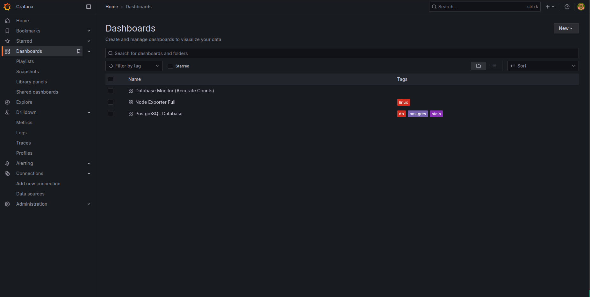
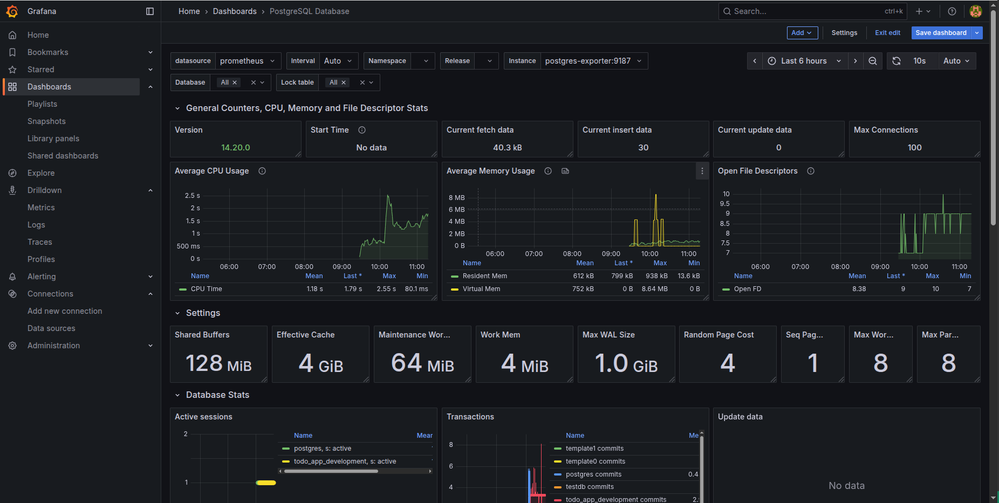

# Grafana
- Grafana là một nền tảng giám sát và phân tích dữ liệu. Nhiệm vụ của nó là thu thập dữ liệu từ các nguồn khác nhau và hiển thị chúng trong các biểu đồ và báo cáo.
- Ở đây ta sẽ dùng Grafana để hiển thị các thông tin từ Prometheus. 

## Cách cấu hình Grafana trong docker compose
```yaml
grafana:
    image: grafana/grafana:latest
    container_name: monitoring_grafana
    volumes:
      - grafana_data:/var/lib/grafana
    ports:
      - "3000:3000"
    environment:
      - GF_SECURITY_ADMIN_USER=admin
      - GF_SECURITY_ADMIN_PASSWORD=admin
    restart: always
```
- Giải thích một 2 config ví dụ ở trên: 
  - `GF_SECURITY_ADMIN_USER`: Tạo tài khoản admin
  - `GF_SECURITY_ADMIN_PASSWORD`: Tạo mật khẩu admin
- Ngoài ra còn các config khác như:
  - `GF_SECURITY_ALLOW_EMBEDDING`: Cho phép nhúng Grafana vào trang web khác (Iframe)
  - `GF_USERS_ALLOW_SIGN_UP`: Tắt tính năng đăng ký User mới (Quan trọng cho Production)
  - `GF_INSTALL_PLUGINS`: Cài đặt các plugin
  - `GF_SMTP_ENABLED`: Cho phép gửi email thông báo
  - `GF_SMTP_HOST`: Địa chỉ SMTP server
  - `GF_SMTP_USER`: Tài khoản SMTP
  - `GF_SMTP_PASSWORD`: Mật khẩu SMTP
  - `GF_SMTP_FROM_ADDRESS`: Địa chỉ email gửi thông báo
  - `GF_SMTP_FROM_NAME`: Tên người gửi
  - `GF_SMTP_DISABLE_STARTTLS_AUTO`: Tắt tự động sử dụng StartTLS
  - `GF_SERVER_ROOT_URL`: URL của Grafana
  - `GF_SERVER_DOMAIN`: Domain của Grafana
  - `GF_AUTH_ANONYMOUS_ENABLED`: Cho phép truy cập không cần đăng nhập
  - `GF_AUTH_ANONYMOUS_ORG_ROLE`: Role của User Anonymous
  - `GF_AUTH_ANONYMOUS_ORG_NAME`: Tên Organization của User Anonymous
  - `GF_AUTH_ANONYMOUS_ORG_ROLE`: Role của User Anonymous

## Hình ảnh và cách sử dụng Grafana
- Ta có thể đăng nhập vào grafana bằng tài khoản admin/admin đã cấu hình ở trên docker compose
- Sau khi chạy docker compose lên ta sẽ được trang web grafana như sau  
    
- Ta cần phải thêm data source vào grafana để có thể hiển thị các thông tin từ prometheus 
    
- Ta cần phải thêm dashboard vào grafana để có thể hiển thị các thông tin từ prometheus   
     
- Có thể sử dụng dashboard có sẵn của grafana hoặc tạo dashboard mới. Các dashboard có sẵn đều có ID và ta có thể thêm vào grafana. Ta vẫn có thể tùy chỉnh thêm bớt xóa sửa các trường trong grafana có sẵn đó tùy vào nhu cầu của bản thân
- Đây là dashboard có sẵn của grafana với id 9628 để monitor dành cho postgre, pgbouncer  
    
- Đây là dasboard tự tạo bằng file json  
    
```json
{
  "annotations": {
    "list": [
      {
        "builtIn": 1,
        "datasource": {
          "type": "grafana",
          "uid": "-- Grafana --"
        },
        "enable": true,
        "hide": true,
        "iconColor": "rgba(0, 211, 255, 1)",
        "name": "Annotations & Alerts",
        "type": "dashboard"
      }
    ]
  },
  "editable": true,
  "fiscalYearStartMonth": 0,
  "graphTooltip": 0,
  "id": 0,
  "links": [],
  "panels": [
    {
      "collapsed": false,
      "gridPos": {
        "h": 1,
        "w": 24,
        "x": 0,
        "y": 0
      },
      "id": 1,
      "panels": [],
      "title": "Database Health Overview (Realtime)",
      "type": "row"
    },
    {
      "datasource": {
        "type": "prometheus",
        "uid": "ff4l4ctxtupz4d"
      },
      "fieldConfig": {
        "defaults": {
          "color": {
            "mode": "palette-classic"
          },
          "custom": {
            "axisBorderShow": false,
            "axisCenteredZero": false,
            "axisColorMode": "text",
            "axisLabel": "",
            "axisPlacement": "auto",
            "barAlignment": 0,
            "barWidthFactor": 0.6,
            "drawStyle": "line",
            "fillOpacity": 10,
            "gradientMode": "opacity",
            "hideFrom": {
              "legend": false,
              "tooltip": false,
              "viz": false
            },
            "insertNulls": false,
            "lineInterpolation": "linear",
            "lineWidth": 2,
            "pointSize": 5,
            "scaleDistribution": {
              "type": "linear"
            },
            "showPoints": "auto",
            "showValues": false,
            "spanNulls": false,
            "stacking": {
              "group": "A",
              "mode": "none"
            },
            "thresholdsStyle": {
              "mode": "off"
            }
          },
          "mappings": [],
          "thresholds": {
            "mode": "absolute",
            "steps": [
              {
                "color": "green",
                "value": 0
              },
              {
                "color": "red",
                "value": 80
              }
            ]
          },
          "unit": "short"
        },
        "overrides": []
      },
      "gridPos": {
        "h": 8,
        "w": 8,
        "x": 0,
        "y": 1
      },
      "id": 2,
      "options": {
        "legend": {
          "calcs": [],
          "displayMode": "list",
          "placement": "bottom",
          "showLegend": true
        },
        "tooltip": {
          "hideZeros": false,
          "mode": "single",
          "sort": "none"
        }
      },
      "pluginVersion": "12.2.1",
      "targets": [
        {
          "expr": "pg_stat_database_numbackends{datname=\"todo_app_development\"}",
          "legendFormat": "Active Connections",
          "refId": "A"
        }
      ],
      "title": "Active Connections",
      "type": "timeseries"
    },
    {
      "datasource": {
        "type": "prometheus",
        "uid": "ff4l4ctxtupz4d"
      },
      "fieldConfig": {
        "defaults": {
          "color": {
            "mode": "thresholds"
          },
          "mappings": [],
          "thresholds": {
            "mode": "absolute",
            "steps": [
              {
                "color": "green",
                "value": 0
              },
              {
                "color": "red",
                "value": 100
              }
            ]
          },
          "unit": "ops"
        },
        "overrides": []
      },
      "gridPos": {
        "h": 8,
        "w": 8,
        "x": 8,
        "y": 1
      },
      "id": 3,
      "options": {
        "colorMode": "value",
        "graphMode": "area",
        "justifyMode": "auto",
        "orientation": "auto",
        "percentChangeColorMode": "standard",
        "reduceOptions": {
          "calcs": [
            "lastNotNull"
          ],
          "fields": "",
          "values": false
        },
        "showPercentChange": false,
        "textMode": "auto",
        "wideLayout": true
      },
      "pluginVersion": "12.2.1",
      "targets": [
        {
          "expr": "rate(pg_stat_database_xact_commit{datname=\"todo_app_development\"}[1m])",
          "refId": "A"
        }
      ],
      "title": "Transactions / Sec (1m avg)",
      "type": "stat"
    },
    {
      "datasource": {
        "type": "prometheus",
        "uid": "ff4l4ctxtupz4d"
      },
      "fieldConfig": {
        "defaults": {
          "color": {
            "mode": "thresholds"
          },
          "mappings": [],
          "max": 1,
          "min": 0,
          "thresholds": {
            "mode": "absolute",
            "steps": [
              {
                "color": "red",
                "value": 0
              },
              {
                "color": "green",
                "value": 0.9
              }
            ]
          },
          "unit": "percentunit"
        },
        "overrides": []
      },
      "gridPos": {
        "h": 8,
        "w": 8,
        "x": 16,
        "y": 1
      },
      "id": 4,
      "options": {
        "minVizHeight": 75,
        "minVizWidth": 75,
        "orientation": "auto",
        "reduceOptions": {
          "calcs": [
            "lastNotNull"
          ],
          "fields": "",
          "values": false
        },
        "showThresholdLabels": false,
        "showThresholdMarkers": true,
        "showthresholdMarkers": true,
        "sizing": "auto"
      },
      "pluginVersion": "12.2.1",
      "targets": [
        {
          "expr": "pg_stat_database_blks_hit{datname=\"todo_app_development\"} / (pg_stat_database_blks_hit{datname=\"todo_app_development\"} + pg_stat_database_blks_read{datname=\"todo_app_development\"})",
          "refId": "A"
        }
      ],
      "title": "Cache Hit Ratio",
      "type": "gauge"
    },
    {
      "collapsed": false,
      "gridPos": {
        "h": 1,
        "w": 24,
        "x": 0,
        "y": 9
      },
      "id": 5,
      "panels": [],
      "title": "Data Mutations (Chính xác số lượng trong 1 phút)",
      "type": "row"
    },
    {
      "datasource": {
        "type": "prometheus",
        "uid": "ff4l4ctxtupz4d"
      },
      "description": "Hiển thị TỔNG SỐ LƯỢNG dòng bị tác động trong 1 phút gần nhất.",
      "fieldConfig": {
        "defaults": {
          "color": {
            "mode": "palette-classic"
          },
          "custom": {
            "axisBorderShow": false,
            "axisCenteredZero": false,
            "axisColorMode": "text",
            "axisLabel": "",
            "axisPlacement": "auto",
            "barAlignment": 0,
            "barWidthFactor": 0.6,
            "drawStyle": "bars",
            "fillOpacity": 100,
            "gradientMode": "none",
            "hideFrom": {
              "legend": false,
              "tooltip": false,
              "viz": false
            },
            "insertNulls": false,
            "lineInterpolation": "linear",
            "lineWidth": 1,
            "pointSize": 5,
            "scaleDistribution": {
              "type": "linear"
            },
            "showPoints": "auto",
            "showValues": false,
            "spanNulls": false,
            "stacking": {
              "group": "A",
              "mode": "none"
            },
            "thresholdsStyle": {
              "mode": "off"
            }
          },
          "mappings": [],
          "thresholds": {
            "mode": "absolute",
            "steps": [
              {
                "color": "green",
                "value": 0
              },
              {
                "color": "red",
                "value": 80
              }
            ]
          },
          "unit": "short"
        },
        "overrides": [
          {
            "matcher": {
              "id": "byName",
              "options": "Rows Deleted (Last 1m)"
            },
            "properties": [
              {
                "id": "color",
                "value": {
                  "fixedColor": "red",
                  "mode": "fixed"
                }
              }
            ]
          },
          {
            "matcher": {
              "id": "byName",
              "options": "Rows Updated (Last 1m)"
            },
            "properties": [
              {
                "id": "color",
                "value": {
                  "fixedColor": "orange",
                  "mode": "fixed"
                }
              }
            ]
          }
        ]
      },
      "gridPos": {
        "h": 10,
        "w": 24,
        "x": 0,
        "y": 10
      },
      "id": 6,
      "options": {
        "legend": {
          "calcs": [
            "max",
            "lastNotNull"
          ],
          "displayMode": "table",
          "placement": "bottom",
          "showLegend": true
        },
        "tooltip": {
          "hideZeros": false,
          "mode": "multi",
          "sort": "none"
        }
      },
      "pluginVersion": "12.2.1",
      "targets": [
        {
          "expr": "increase(pg_stat_database_tup_updated{datname=\"todo_app_development\"}[1m])",
          "legendFormat": "Rows Updated (Last 1m)",
          "refId": "A"
        },
        {
          "expr": "increase(pg_stat_database_tup_deleted{datname=\"todo_app_development\"}[1m])",
          "legendFormat": "Rows Deleted (Last 1m)",
          "refId": "B"
        },
        {
          "expr": "increase(pg_stat_database_tup_inserted{datname=\"todo_app_development\"}[1m])",
          "legendFormat": "Rows Inserted (Last 1m)",
          "refId": "C"
        }
      ],
      "title": "Data Changes Count (Last 1 Minute)",
      "type": "timeseries"
    }
  ],
  "preload": false,
  "refresh": "auto",
  "schemaVersion": 42,
  "tags": [],
  "templating": {
    "list": []
  },
  "time": {
    "from": "now-6h",
    "to": "now"
  },
  "timepicker": {},
  "timezone": "",
  "title": "Database Monitor (Accurate Counts)",
  "uid": "db-monitor-real",
  "version": 3
}
```
- Có thể edit từng trường thông tin trong file json này hoặc edit trực tiếp ở trong trường đó  
    
    