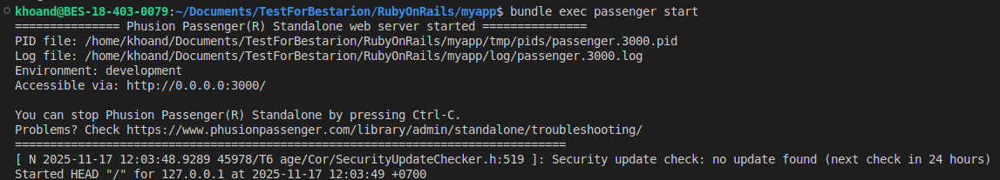
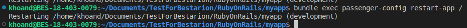
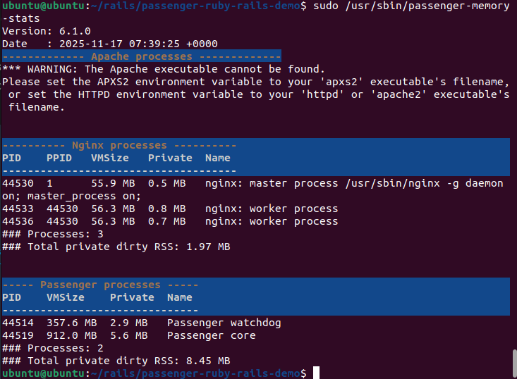

# Cách cài đặt Passenger vào thẳng Project Rails (Standalone)
- Ta cần phải có một project Rails.
- Có thể tự tạo hoặc có sẵn một project nào đó. Ở đây ta sẽ sử dụng project example của Passenger gợi ý

```bash
git clone https://github.com/phusion/passenger-ruby-rails-demo.git
cd passenger-ruby-rails-demo
```
- Sau khi đã clone project về xong ta cần thêm dòng sau vào `Gemfile`
```ruby
gem "passenger", ">= 5.3.2", require: "phusion_passenger/rack_handler"
```
- Sau đó ta chạy lệnh `bundel install` để cài đặt các bundle cần thiết  
    
- Passenger còn cung cấp cho ta cách restart
    
- Hoặc chạy với lệnh không tương tác  
    

- Cách này dễ cài đặt, rất tốt để test nhanh. Nginx chỉ làm nhiệm vụ "chuyển tiếp" request đến một quy trình Passenger đang chạy độc lập.
## Setup Passenger kết nối với Nginx
- Nếu sử dụng cách đưa thẳng passenger vào Project Rails, ta sẽ sử dụng cách sau
- Vào config file`/etc/nginx/site-available/default` hoặc `/etc/nginx/site-enabled/default` để Nginx "lắng nghe" request từ bên ngoài (ví dụ cổng 8080) và "chuyển tiếp" (proxy) chúng đến Passenger (đang chạy ở cổng 3000).

Mô hình: `User` -> `Nginx (ví dụ: cổng 8080)` -> `Passenger (ví dụ: cổng 3000)` -> `Rails App`

```conf
# /etc/nginx/sites-available/todo_app.conf

server {
    listen 8080;
    server_name localhost;
    
    # Quan trọng: Trỏ root đến thư mục /public
    root /home/khoand/Documents/TestForBestarion/RubyOnRails/todo_app/public;

    # 1. Chuyển tiếp (proxy) tất cả request động đến Passenger
    location / {
        proxy_pass [http://127.0.0.1:3000](http://127.0.0.1:3000); # Giả sử passenger start chạy ở cổng 3000

        # CẤU HÌNH QUAN TRỌNG:
        # Gửi đúng host (bao gồm cả cổng) để tránh lỗi CSRF
        proxy_set_header Host $http_host;
        
        proxy_set_header X-Real-IP $remote_addr;
        proxy_set_header X-Forwarded-For $proxy_add_x_forwarded_for;
        proxy_set_header X-Forwarded-Proto $scheme;
    }
    
    # 2. Tự phục vụ (serve) các file tĩnh
    location ~* \.(jpg|jpeg|gif|css|png|js|ico|html)$ {
        expires max;
        log_not_found off;
    }
}
```
## Thêm config cho Passenger
- Để thêm các config cho Passenger ta cần thêm các tham số khi chạy lệnh `passenger start`
- Các tham số quan trọng như:
  - `-p`: Chỉ định cổng chạy
  - `-e`: Môi trường khi chạy
  - `--min-instances`: Số quy trình tối thiểu luôn chạy
  - `--max-instances`: Số quy trình tối đa chạy

# Cách cài đặt Passenger theo dạng module Nginx
- Ở đây ta sẽ cài đặt Passenger dưới dạng module cho Nginx 
```bash
# Install our PGP key and add HTTPS support for APT
sudo apt-get install -y dirmngr gnupg apt-transport-https ca-certificates curl

curl https://oss-binaries.phusionpassenger.com/auto-software-signing-gpg-key.txt | gpg --dearmor | sudo tee /etc/apt/trusted.gpg.d/phusion.gpg >/dev/null

# Add our APT repository
sudo sh -c 'echo deb https://oss-binaries.phusionpassenger.com/apt/passenger jammy main > /etc/apt/sources.list.d/passenger.list'
sudo apt-get update

# Install Passenger + Nginx module
sudo apt-get install -y libnginx-mod-http-passenger
```
- Enable Passenger Nginx module và restart Nginx
```bash
if [ ! -f /etc/nginx/modules-enabled/50-mod-http-passenger.conf ]; then sudo ln -s /usr/share/nginx/modules-available/mod-http-passenger.load /etc/nginx/modules-enabled/50-mod-http-passenger.conf ; fi
sudo ls /etc/nginx/conf.d/mod-http-passenger.conf

sudo service nginx restart
```
- Sau khi cài đặt xong ta có thể validate cài đăt bằng cách
```bash
sudo /usr/bin/passenger-config validate-install
```
- Có thể xem các thông số mà Passenger và Nginx chiếm 
```bash
sudo /usr/sbin/passenger-memory-stats
```  
- Sau khi chạy ta sẽ được như sau
    

Mô hình: `User` -> `Nginx + Passenger Module (cổng 80)` -> `Rails App`

- Vào config file`/etc/nginx/site-available/default` hoặc `/etc/nginx/site-enabled/default`

```conf
# /etc/nginx/sites-available/todo_app.conf

server {
    # Chạy ở cổng 8080
    listen 8080;
    
    server_name localhost;

    # 1. Trỏ root đến thư mục /public
    root /home/khoand/Documents/TestForBestarion/RubyOnRails/todo_app/public;

    # 2. Kích hoạt Passenger
    passenger_enabled on;
    
    # 3. Trỏ đến RVM wrapper của Ruby 3.1.4
    passenger_ruby /usr/share/rvm/wrappers/ruby-3.1.4/ruby;

    # 4. Cấu hình Passenger (chạy ở chế độ development)
    passenger_app_env development;

    # Bảo Passenger chạy app với tư cách user 'khoand'
    passenger_user khoand;
    # (Nhóm của bạn có thể cũng là 'khoand')
    passenger_group khoand;
    # ============================
}
```
## Thêm config cho Passenger
- Ta có thể cấu hình trực tiếp cho Passenger vào file config của Nginx tại `etc/nginx/nginx.conf` trong khối `http`
- Các cấu hình quan trọng:
  - `passenger_app_env`: Chỉ định môi trường chạy ứng dụng
  - `passenger_min_instances`: Số quy trình tối thiểu luôn chạy
  - `passenger_max_pool_size`: Số quy trình tối đa
  - `passenger_max_requests`: Số request tối đa cho mỗi quy trình. Tự động restart quy trình sau X request để tránh rò rỉ bộ nhớ

## Lỗi đã gặp và cách khắc phục
- Lỗi quyền: Do tiến trình Nginx chạy với tư cách user www-data nên không có quyền đi vào thư mục `/home/khoand/Documents/TestForBestarion/RubyOnRails/todo_app/public` để đọc file cấu hình và ứng dụng
- Cách sửa: 
  - Thêm quyền để chúng có thể đi qua bằng `chmod o+x /home/khoand/Documents/TestForBestarion/RubyOnRails/todo_app`
  - Chỉ định User chạy app: thêm `passenger_user khoand` vào file `default` để nói nginx sẽ sử dụng user khoand để khởi chạy ứng dụng